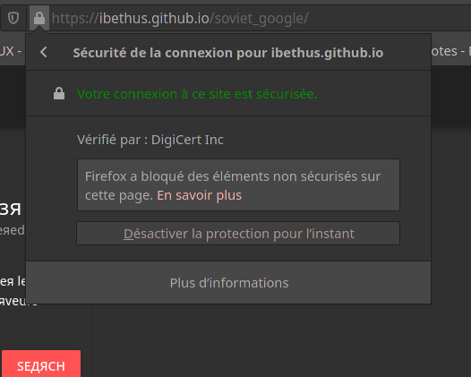

# Soviet Google

## Fonctionnalités

* Météo : Permet de rechercher la météo actuelle pour une ville donnée

* Image : Permet de rechercher une image via l'API de Flickr et de l'afficher, avec une certaine *USSR flavor* 

* Twitter : Affiche la timeline de notre cher *comrade* à tous : Michel B.

* News : Permet de rechercher les dernières news en date relatives à un mot-clef

* Date et heure : Donne la date et l'heure actuelle du système

* Youtube : Affiche une vidéo, et une seule...

* ColorPicker : Cette petite pastille colorée permet de changer la couleur de fond des widgets. L’œil averti notera que la couleur de la police s'adapte en fonction

* Sauvegarder : L'utilisateur peut sauvegarder les widgets chargés, ainsi que leur couleur, dans le local storage. A l'heure actuelle, la position exacte des widgets n'est pas conservée, seulement leur ordre. Les informations qu'ils contiennent ne sont pas non plus sauvegardées.

> Chaque widget possède une option de suppression, il s'agit de la petite corbeille rouge

## Utilisation en ligne

Le site est accessible en ligne à la page https://ibethus.github.io/soviet_google/

Quelques remarques sont à noter concernant son utilisation : 

* GitHub Pages n'autorise pas la réception de requêtes non sécurisées (http). Pour utiliser l'API WeatherStack (SovietWeather), il est nécessaire de désactiver la connexion sécurisée.

  

* Le widget nécessitant l'utilisation de l'API news ne fonctionne pas lorsque le site est utilisé en ligne (par l'opposition à sa version en localhost), car l'API est désormais payante pour toute utilisation en dehors de la phase de développement. Si dessous, une procédure est indiquée pour lancer le projet en local si l'on souhaite tester le widget news.

## Utilisation en localhost
1. Cloner le projet depuis github
2. Se placer dans le dossier source
3. Il faut avoir npm installé sur sa machine et lancer la commande suivante :
```bash
npm run serve
```
4. Cette commande build le projet et le rend accessible en localhost à l'adresse indiquée dans le terminal.

